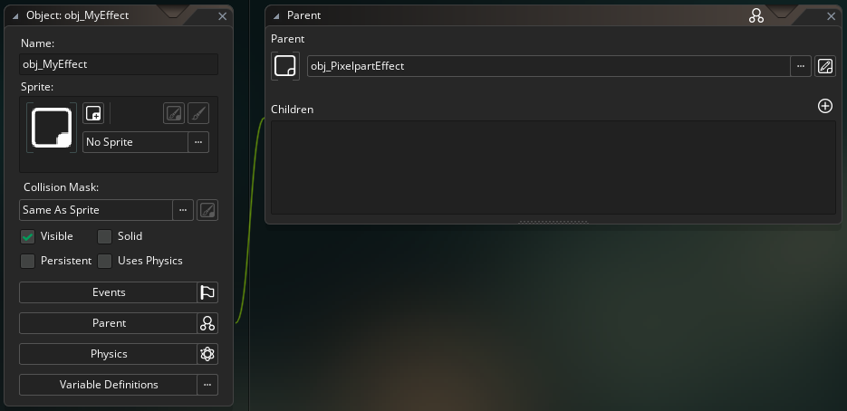
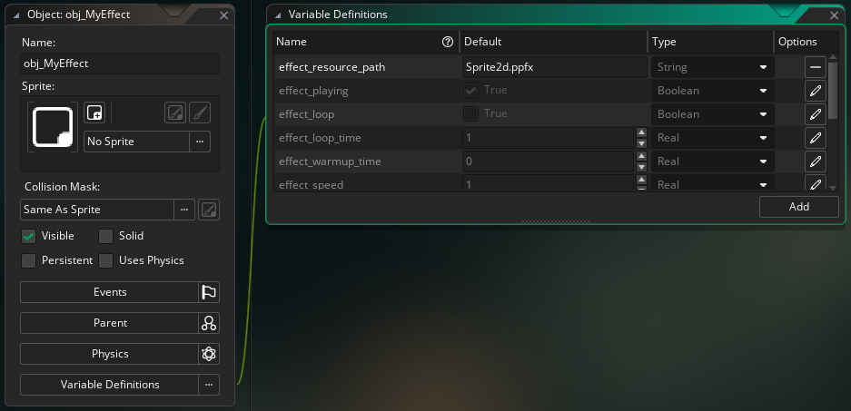

# Pixelpart for GameMaker

This repository contains the official Pixelpart plugin for GameMaker 2024+. The plugin allows you to play Pixelpart effects directly within the GameMaker engine.

## Installation

Download the plugin from [pixelpart.net](https://pixelpart.net/plugins/). It comes with prebuilt binaries for the supported platforms (see below). In GameMaker, go to *Tools > Import Local Package* in the top menu and select the *net.pixelpart.pixelpartgm.yymps* package you just downloaded. Then import all files.

## Usage

Here are the basic steps to display a Pixelpart effect in GameMaker. A detailed user guide can be found on [pixelpart.net](https://pixelpart.net/documentation/gamemaker/).

1. Add the *.ppfx* file created with the Pixelpart editor to the *Included Files* of your GameMaker project.

2. Create a custom object, for example *obj_MyEffect*, and set *obj_PixelpartEffect* as its parent. The *obj_PixelpartEffect* object acts as a base object for all Pixelpart effects.

3. Set the **effect_resource_path** variable of *obj_MyEffect* to the filename of the *.ppfx* effect file. The *obj_PixelpartEffect* object uses this variable to determine which effect to play.

4. Finally, add an instance of *obj_MyEffect* to a room to display the effect.

## Supported Platforms

The plugin supports the following target platforms:

- Windows
- Linux
- macOS
- iOS
- Android
- HTML5

Console and GX.games targets are not supported.
