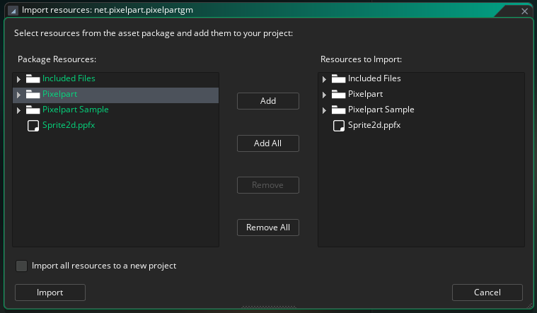

# Installation

You can install the Pixelpart plugin in your GameMaker project in the following way:

1. Download the plugin package *net.pixelpart.pixelpartgm.yymps* from the Pixelpart website.
2. In GameMaker, go to *Tools* and *Import Local Package* in the top menu.
3. Then, select the *net.pixelpart.pixelpartgm.yymps* package and import all files.

