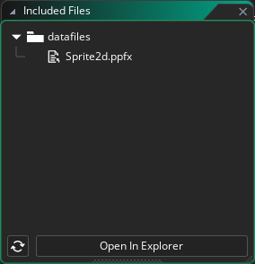

# Usage

Before you can play Pixelpart effects in your game, make sure to add the *.ppfx* effect files as *Included Files* to your GameMaker project. This way, the effects are included when exporting the game.



The Pixelpart plugin supports two different workflows for integrating Pixelpart effects into your game, an object-based workflow and a script-based workflow.

## Object-based workflow

The object-based workflow is the preferred approach and makes use of the *obj_PixelpartEffect* object, which acts as a base object for all Pixelpart effect. Create a custom object, for example *obj_MyEffect*, and set *obj_PixelpartEffect* as its parent.


Then, set the **effect_resource_path** variable of *obj_MyEffect* to the filename of the *.ppfx* effect file. The *obj_PixelpartEffect* object uses this variable to determine which effect to play.


Finally, add an instance of *obj_MyEffect* to a room to display the effect. You can further customize the effect's behavior by adjusting the following properties:

Property | Description
-------- | -----------
**effect_resource_path** | The effect to be played. Cannot be set at runtime.
**effect_playing** | Whether the effect is playing or paused.
**effect_loop** | If enabled, the effect is repeated after the time specified in **effect_loop_time**.
**effect_loop_time** | Time in seconds after which the effect is repeated. Only has an effect if **effect_loop** is enabled.
**effect_warmup_time** | Time in seconds the effect is pre-simulated before being rendered. This value impacts performance and should be kept as low as possible.
**effect_speed** | Multiplier for the playback speed of the effect. For example, setting **effect_speed** to *0.5* shows the effect in slow motion.
**effect_frame_rate** | How many iterations are simulated per second. Can be used to improve performance for complex effects.
**effect_seed** | Seed used to initialize the effect simulation. This seed is used if **effect_random_seed** is not enabled.
**effect_random_seed** | Whether to use a random seed to initialize the effect simulation.
**effect_scale** | Multiplier for the size of the effect. Adjust this value if the effect appears too small or too large in the scene.
**effect_flip_h** | Whether the effect is flipped horizontally.
**effect_flip_v** | Whether the effect is flipped vertically.

## Script-based workflow

The script-based workflow offers more control and does not require you to create any new objects, but it is more complicated as the effect is loaded and played entirely with *GML* scripts.

First, initialize a *PixelpartEffectResource*, which is a struct that represents a loaded *.ppfx* file and call its *load* method to load a Pixelpart effect into memory. Then, create a *PixelpartEffect* passing in the effect resource as a constructor argument. This struct is responsible for simulating and drawing the effect. You can reuse the same *PixelpartEffectResource* for other *PixelpartEffects* if you want to play the same effect using different parameters. The code for that could be put into a *Create* script of some other object, for example.

```gml
effect_resource = new PixelpartEffectResource();
effect_resource.load("Sprite2d.ppfx");

effect = new PixelpartEffect(effect_resource);
```

To step the effect simulation, use the *advance* method of the *PixelpartEffect* struct. The first argument represents the time in seconds to advance the effect simulation. In most cases you should use the time passed since the last frame, i.e. *delta_time* and convert it to seconds. You also need to provide the x and y position of the effect as the second and third argument. This code could be put into a *Step* script, for example.

```gml
effect.advance(delta_time / 1000000, x, y);
```

To actually draw the effect, call the *draw* method. This should be done inside a *Draw* event.

```gml
effect.draw();
```

Do not forget to cleanup the effect and effect resource when you no longer need them.

```gml
effect.cleanup();
delete effect;

effect_resource.cleanup();
delete effect_resource;
```
